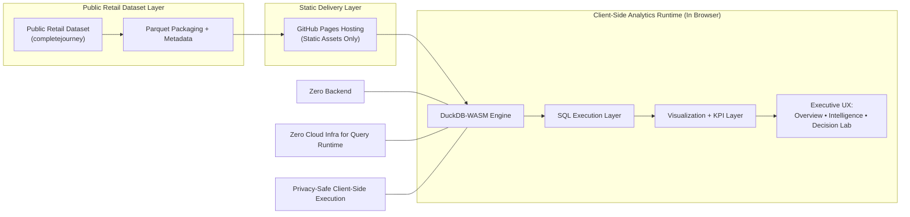

# Retail Decision Intelligence Platform
[](https://arvind3.github.io/retail_analytics/#/)
[](https://github.com/arvind3/retail_analytics)

An enterprise-ready retail analytics experience that delivers executive insights, customer intelligence, and ad hoc analysis directly in the browser with DuckDB-WASM.

## Product Vision
Build a modern analytics platform where every business stakeholder can answer high-impact retail questions in seconds without waiting on backend pipelines, BI queues, or infrastructure provisioning.

## Business Problem It Solves
Retail leaders are often forced to make pricing, promotion, and category decisions with delayed insights and fragmented tools. Traditional analytics stacks can be expensive, slow to change, and disconnected from day-to-day decision cycles.

This platform addresses that gap by providing:
- Immediate access to performance, customer, and promotion intelligence
- Executive-ready dashboards that communicate what changed and why it matters
- A self-service analysis workspace for rapid follow-up questions
- Static deployment with zero operational analytics infrastructure

## Why DuckDB-WASM + In-Browser Analytics Is Revolutionary
DuckDB-WASM moves analytical compute from centralized infrastructure to the end user’s browser tab.

That unlocks a new operating model:
- No running analytics backend
- No managed database cluster
- No server-side query orchestration
- No data egress for interactive analysis sessions

The result is a faster, lower-cost, privacy-safer analytics delivery model that still supports rich SQL and dashboard experiences.

## Why This Matters for Enterprises
- Cost discipline: Remove recurring infrastructure spend for interactive analytics workloads.
- Decision velocity: Reduce time-to-insight from report cycles to real-time exploration.
- Governance by design: Keep interactive analysis client-side for privacy-safe execution patterns.
- Deployment simplicity: Ship as static assets through standard enterprise release workflows.
- Executive alignment: Translate raw metrics into decisions around revenue, basket growth, retention, and promotion impact.

## Key Capabilities
- Executive Overview: Net sales, trips, active households, basket value, and promotion conversion.
- Customer & Promotion Intelligence: Retention cohorts, campaign lift, segment response, and affinity analysis.
- Decision Lab: Prebuilt and custom SQL analysis with optional instant visualization.
- Business Interpretation Layer: Each view explains what is shown, why it matters, and how to interpret.
- Offline-friendly Analytics Runtime: DuckDB-WASM executes queries in-browser against local Parquet assets.

## Technical Architecture


## User Experience Walkthrough
### Start Here
Open the live dashboard: https://arvind3.github.io/retail_analytics/#/

### Recommended Journey
1. Open **Executive Overview** (`#/`) first.
What to look for: net sales momentum, basket value distribution, category concentration, and promotion impact.

2. Move to **Customer & Promotion Intelligence** (`#/insights`).
What to look for: retention curve shape, promotion response by segment, campaign lift, and cross-sell opportunities.

3. Use **Decision Lab** (`#/sql-studio`) for follow-up analysis.
What to look for: validate hypotheses, refine business questions, and share deep-dive query links.

### What You Are Seeing, Why It Matters, How To Interpret
- What you are seeing: curated KPI and analytics views designed for retail decision cycles.
- Why it matters: each view ties directly to revenue growth, margin control, retention, and promotional efficiency.
- How to interpret: built-in business context guides action, not just observation.

## Performance & Scalability Advantages
- In-browser execution reduces backend latency and eliminates network round-trips for each query.
- Columnar Parquet + DuckDB vectorized execution delivers fast analytical scans for interactive workloads.
- Static hosting scales naturally with CDN delivery patterns and minimal operational overhead.
- The architecture supports progressive dataset strategies (sampling, partitioning, and alternate dataset paths).

## Quality & Validation
### Automated Checks
- Type safety with strict TypeScript
- Linting and formatting standards
- Unit tests for formatting and core utilities
- End-to-end Playwright tests for:
  - dashboard loading
  - chart rendering
  - SQL execution
  - browser console/page error detection

### Performance Validation
- Build output validation in CI on every push to `main`
- Runtime verification through E2E navigation and query execution flows
- DuckDB initialization and data loading states validated in automated scenarios

### Cross-Browser Compatibility
- Playwright baseline coverage with Chromium in CI
- Architecture is browser-native and deployable to any modern standards-compliant browser environment
- Static delivery on GitHub Pages ensures consistent global access without runtime service dependencies

## Deployment
- Source: https://github.com/arvind3/retail_analytics
- Live product: https://arvind3.github.io/retail_analytics/#/
- Deployment model: GitHub Actions builds and deploys static assets to GitHub Pages on every `main` push

## Local Development
```bash
npm install
python -m pip install pandas pyarrow pyreadr
npm run prepare:data
npm run dev
```

### Full Validation Locally
```bash
npm run lint
npm run typecheck
npm run e2e
```

## Future Roadmap
1. Scenario Planning: Add what-if simulation for pricing, promotions, and category mix shifts.
2. Semantic Metrics Layer: Define governed business metrics and executive narrative templates.
3. Advanced Segmentation: Introduce lifecycle, churn-risk, and value-cluster modeling.
4. Collaboration Features: Shareable insight packs and decision snapshots for leadership reviews.
5. Enterprise Integrations: Bring-your-own data connectors and governed dataset onboarding paths.
