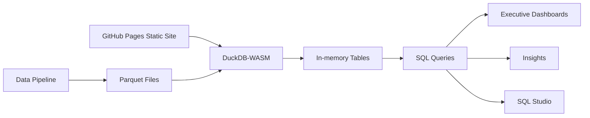

# Retail Analytics • DuckDB-WASM In-Browser Demo

This demo proves that leadership-grade retail analytics can run entirely in the browser: DuckDB-WASM executes analytical SQL on the completejourney (84.51 / dunnhumby) grocery dataset with no backend, no server database, and no data warehouse. Executives get fast KPI views, deep customer insights, and a full SQL studio—all delivered as a static GitHub Pages site.

## Architecture



## Run Locally

1. Install dependencies

```bash
npm install
```

2. Generate data (requires R + CRAN access)

```bash
npm run prepare:data
```

3. Start the dev server

```bash
npm run dev
```

4. Run tests

```bash
npm test
npm run e2e
```

To test a deployed (live) URL with Playwright:

```bash
$env:PLAYWRIGHT_BASE_URL = "https://<your-gh-pages-url>"
npm run e2e:live
```

Data validation requires Python with `pandas` and `pyarrow`:

```bash
python -m pip install pandas pyarrow
```

## Update the Dataset

The data pipeline pulls the CRAN `completejourney` package and exports Parquet files.

```bash
# Optional: limit size for faster demos (last N weeks)
$env:CJ_SLICE_WEEKS = "26"
# Optional: hard limit rows
$env:CJ_SLICE_ROWS = "200000"
# Optional: skip Apache Arrow and use nanoparquet
$env:CJ_USE_ARROW = "0"

npm run prepare:data
```

Parquet outputs land in `data/parquet`, and metadata is written to `data/metadata.json`. Swap in a full dataset by replacing Parquet files with compatible schemas.

The pipeline also syncs outputs to `public/data` so Vite and GitHub Pages can serve the files statically.

To point the app at an alternate dataset folder (for example `data/parquet_full`), set:

```bash
VITE_DATASET_PATH=data/parquet_full
```

## Quality & CI

- ESLint + Prettier enforce code quality
- TypeScript strict mode catches type regressions
- Vitest for unit tests
- Playwright E2E tests validate all three pages, DuckDB init, and chart rendering
- Data validation checks in `scripts/validate_data.py`
- GitHub Actions runs CI on pull requests and deploys to GitHub Pages on main

## Why This Matters

This architecture removes backend infrastructure while keeping analytical depth. Leadership can run self-service analysis in a tab, with SQL and dashboards powered entirely by DuckDB-WASM, resulting in faster iteration, lower cost, and higher trust in the data story.
